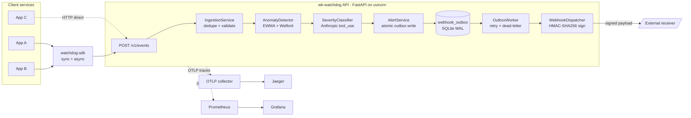

# wk-watchdog

[](https://github.com/willianpinho/wk-watchdog-genai/actions/workflows/ci.yml)

> Intelligent log-anomaly watchdog with LLM severity reasoning and signed webhook alerting.

`wk-watchdog` ingests log events from any service, detects statistical
anomalies per `(service, level)` window with an EWMA + Welford
detector, asks an LLM to classify the severity (Anthropic Claude with
structured `tool_use` output), and delivers HMAC-signed webhook
notifications through a transactional outbox so a process crash never
loses an alert.

The watchdog also instruments itself end-to-end: OpenTelemetry spans
flow to Jaeger, Prometheus scrapes custom metrics, Grafana dashboards
are pre-provisioned, and structured logs carry `trace_id` + `span_id`
out of the box. Python SDK on the client side: sync + async, jittered
retry, drop-in stdlib-`logging` integration.

## 30-second quickstart

```bash
git clone https://github.com/willianpinho/wk-watchdog-genai.git
cd wk-watchdog-genai
make up            # docker compose: api + otel-collector + jaeger + prom + grafana
make demo          # 5 minutes of synthetic traffic with a planted anomaly burst
# open http://localhost:8000          ← dashboard (event rate + alerts)
# open http://localhost:3000          ← Grafana, pre-provisioned, anonymous-Viewer
# open http://localhost:16686         ← Jaeger traces
```

## Architecture



## Tech choices

| Choice                      | Reason                                                                                   | Alternative considered                    | Why rejected                                                                                                           |
| --------------------------- | ---------------------------------------------------------------------------------------- | ----------------------------------------- | ---------------------------------------------------------------------------------------------------------------------- |
| **Python 3.12**             | Best typing ergonomics today (`datetime.UTC`, Pydantic v2 stable).                       | 3.13                                      | Free-threaded GIL ecosystem still maturing; we use `__future__` annotations heavily — gains are flat for our workload. |
| **FastAPI** + uvicorn       | Async-native, free OpenAPI, Pydantic v2 contracts, idiomatic for Senior Python.          | Flask, Starlette-direct                   | Flask lacks async + OpenAPI; Starlette is too low-level for this scope.                                                |
| **aiosqlite (WAL)**         | Zero ops, single file; ADR-0002 documents the Postgres migration trigger.                | Postgres from day 1                       | Adds container, auth, backup pipeline for an MVP at < 50 req/s.                                                        |
| **EWMA + Welford detector** | O(1) update, drift-robust, no scipy dep. Welford 1962 (ADR-0003).                        | scipy.stats, Prophet, river               | scipy ~150 MB; Prophet over-engineered; river adds a learning curve for a 60-LOC computation.                          |
| **Anthropic `tool_use`**    | Structured output enforced by the API; the model MUST call `record_severity`. (ADR-0004) | Free-text + regex parse, OpenAI JSON-mode | Hallucinated severities; regex brittle; tool_use is the canonical correctness path.                                    |
| **Outbox pattern**          | At-least-once webhook delivery; no dual-write race. Richardson 2019 §3.2 (ADR-0005).     | POST-after-commit; AWS SQS                | Naive loses messages on crash; SQS adds cloud coupling for a free-DB MVP.                                              |
| **OpenTelemetry SDK**       | Vendor-neutral; auto-instruments FastAPI + httpx; the watchdog watches itself.           | Datadog / NR agent                        | Vendor lock-in; OTel gives the same data with portability.                                                             |
| **HTMX + uPlot (SSR)**      | TTFP wins; zero JS build step on a backend repo. (ADR-0006)                              | React/Next SPA, Chart.js                  | SPA needs Node toolchain; Chart.js ~200 KB vs uPlot ~50 KB at higher fidelity.                                         |
| **GitHub Actions**          | Hosted, free for OSS; ghcr.io one API call away.                                         | CircleCI, Buildkite                       | Same primitives, more vendor surface for this submission.                                                              |
| **uv (Astral)**             | 10× pip on cold installs; workspace-native.                                              | pip-tools, Poetry                         | pip-tools lockfile weaker; Poetry heavier with plugin churn.                                                           |

## Production readiness

| Capability                         | Status                | Notes                                                                                                                                                                                   |
| ---------------------------------- | --------------------- | --------------------------------------------------------------------------------------------------------------------------------------------------------------------------------------- |
| Event ingestion + validation       | ✅ Done               | `POST /v1/events`, ≤ 1 000 events/request, 5-second dedupe window                                                                                                                       |
| Anomaly detection                  | ✅ Done               | EWMA per `(service, level)` minute buckets, 60-bucket effective window                                                                                                                  |
| LLM severity classification        | ✅ Done               | Anthropic `tool_use` + rule-based fallback (`model="rule-based-fallback"`) on retry/cost-cap                                                                                            |
| Webhook delivery                   | ✅ Done               | HMAC-SHA256 sign, outbox + 5-attempt retry + dead-letter                                                                                                                                |
| OpenTelemetry self-instrumentation | ✅ Done               | OTLP HTTP spans, Prometheus metrics, structlog `trace_id` binding                                                                                                                       |
| Dashboard                          | ✅ Done               | Server-rendered, vendored uPlot, ~56 KB page weight                                                                                                                                     |
| SDK (sync + async)                 | ✅ Done               | Retry policy, drop-in `logging` adapter, mypy-strict standalone                                                                                                                         |
| CI/CD                              | ✅ Done               | 6-job CI + tag-driven release + CodeQL + Dependabot + PR template                                                                                                                       |
| Docker image                       | ✅ Done               | Multi-stage slim, non-root, tini PID 1, `HEALTHCHECK` on `/readyz`                                                                                                                      |
| Authentication                     | 🟡 Stubbed            | `Authorization: Bearer` is parsed but not validated. Production needs JWT/JWKS or an API-key store.                                                                                     |
| Multi-tenancy                      | 🚫 Out of scope       | Single-tenant data model; row-level security is a Postgres-migration concern.                                                                                                           |
| Horizontal scale                   | 🚫 Out of scope       | SQLite single-writer ceiling. Outbox worker is intentionally single-instance because SQLite lacks `SELECT … FOR UPDATE SKIP LOCKED` (ADR-0005). Postgres migration unblocks N replicas. |
| SSE alert stream                   | 🟡 SDK ships the type | Server-side endpoint pending (see `packages/watchdog-sdk/TODO.md`).                                                                                                                     |

## Demo

```bash
make demo
# → ~3 events/sec baseline across { auth-api, checkout, search } for 3 min
# → 20 ERROR events/sec burst on `bursty-service` for 30 s
# → 90 s cooldown for detector → classifier → outbox → dispatcher chain
# → prints the alert id + dashboard URL
```

Screenshots live under [`docs/demo/`](docs/demo/). They are populated by
a follow-up `make demo-screenshot` (Playwright-based capture) — the
demo above is the primary path and proves the end-to-end pipeline with
nothing but `curl`-equivalent calls.

## Tests

```bash
make test            # default: unit + integration, ~7 s, 98 tests
make test-core       # gate: watchdog_core coverage >= 90 %
make test-api        # gate: watchdog_api coverage >= 80 %
make test-slow       # opt-in: large-state-space Hypothesis tests
make test-contract   # documented CLI: schemathesis against the running API
```

CI runs the matrix above on every push + PR (see
[`.github/workflows/ci.yml`](.github/workflows/ci.yml)). Per-package
coverage gates fail the build under threshold. Marker taxonomy and
testcontainers decision documented in [`docs/TESTS.md`](docs/TESTS.md).

## Layout

```
wk-watchdog/
├── apps/api/                        # FastAPI app, routes, dashboard, observability glue
├── packages/
│   ├── watchdog-core/                # domain + persistence + detection + GenAI + alerting
│   └── watchdog-sdk/                 # publishable Python client (sync + async + logging)
├── docs/
│   ├── adr/                          # 6 architecture decision records
│   ├── TESTS.md                      # marker taxonomy + testcontainers decision
│   └── demo/                         # screenshots (filled by make demo-screenshot)
├── docker/                           # otel-collector, prometheus, grafana provisioning
├── scripts/                          # demo.py, seed_traffic.py, test_docker_smoke.sh
├── .github/                          # 3 workflows + dependabot + PR template
├── submission/                       # CHECKLIST, presentation.md, SUBMISSION.md
├── prompts.md                        # turn-by-turn audit log (the meta-deliverable)
└── pyproject.toml                    # uv workspace root + tool config + dev deps
```

## SDK

```python
import logging
from watchdog_sdk import WatchdogClient, instrument_logging

client = WatchdogClient(base_url="https://watchdog.your.host", api_key="…")
instrument_logging(logging.getLogger(), client=client, service="my-app")

logging.error("payment declined: order=%s", order_id)   # → watchdog
```

Sync + async, retry-with-jitter, `traceparent` injection if otel is
installed in the caller. Full docs in
[`packages/watchdog-sdk/README.md`](packages/watchdog-sdk/README.md).

## Submission

`prompts.md` is the meta-deliverable — every prompt pasted into the
Vibe-Coding session, verbatim, with the AI's action summary,
verification output, and discipline incidents recorded honestly.
Several discipline incidents are documented inline (over-staging in
Turn 2, formatter-import-drop races, schemathesis contract gaps).

The Tag from Tagle.ai (`submission/tagle-tag.{md,png}`), the slide
deck (`submission/presentation.md`), and the reviewer reading order
(`submission/SUBMISSION.md`) complete the submission packet.

## License

MIT — see `LICENSE`.
